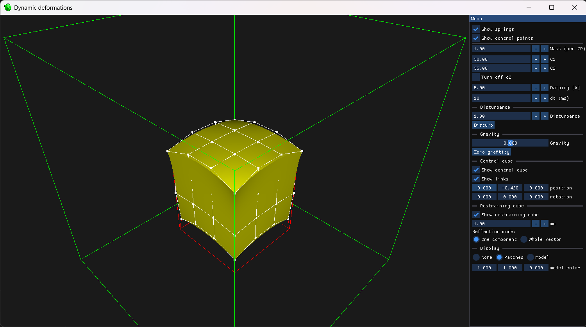

# Jelly (Dynamic deformations)
The program was developed as part of the course 'Physics Simulations in a Virtual Environment'.

Simulates a deformable 3D Bezier cube made of 64 spring-connected masses. Main features:

- Real-time elastic deformation and shading  
- Interactive control frame (move/rotate)  
- Collision handling with bounding box  
- Configurable mass, spring, damping, and initial conditions  
- Deforms embedded 3D objects using Bernstein polynomials  

## Stack
Here is the stack used to develop this piece of software:
### Main:
- C++
- OpenGL (GLSL)
### Dependencies:
- ImGui - UI
- GLFW - windowing
- GLM - math